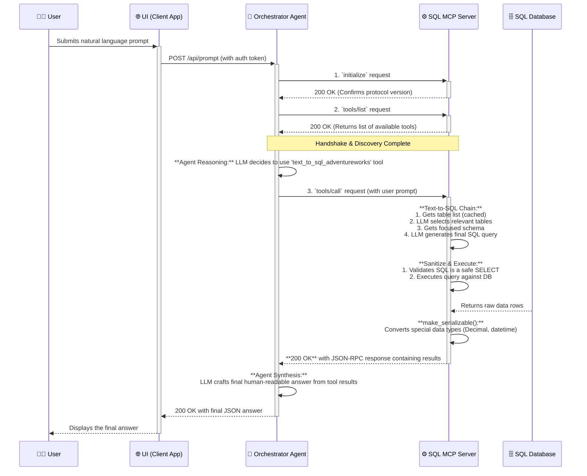

# Multi-Model Context Protocol (MCP) Agent

This repository contains a complete, functioning reference implementation of an advanced AI agent built on the **Model Context Protocol (MCP)**. The project demonstrates how to build a secure, extensible, and robust system that can reason over and interact with multiple, disparate data sources, serving as a blueprint for real-world enterprise AI solutions.

The architecture uses a **LangGraph-based agent** as the central orchestrator, which intelligently routes requests to specialized MCP "tool servers." This implementation includes:

1. A **custom-built Text-to-SQL MCP server** that connects to a SQL database (AdventureWorksLT2019).
2. A seamless integration with the official **Azure MCP server**, demonstrating multi-transport (`http` and `stdio`) capabilities.

## Architectural Overview

This solution is following a phased architectural approach i.e. Transition to Target, inspired by **TOGAF**.

### The Transition Architecture (What's in this Repo)

This repository provides the complete code for a functioning **Transition Architecture**. It is a fully debugged and protocol-compliant implementation that proves the core logic and integrations work as designed. It's intended to be a tangible starting point for developers to explore and extend.

### The Target Architecture (The Production Vision)

The design is forward-looking, with a clear path to a **Target Architecture** on Microsoft Azure. This production blueprint incorporates enterprise-grade security, governance, and automation, including:

- **Zero-Trust Security** with Microsoft Entra ID and Azure Virtual Networks.
- **Human-in-the-Loop (HITL)** verification workflows for critical queries.
- **Automated CI/CD** pipelines for reliable, repeatable deployments.

## Repository Contents

This repository is being used for both local development and cloud deployment.

- **`/orchestrator` & `/local_mcp_server`:** These directories contain the source code for the two core microservices.
- **Deployment Assets:** The repository also includes production-ready assets that are not used in the local setup but are essential for a cloud deployment:
  - **`Dockerfile`** in each service directory for containerizing the applications.
  - **`.github/workflows/deploy.yml`** which defines a complete CI/CD pipeline using GitHub Actions to automatically build the container images and deploy them to Azure.

## The User Journey: A Detailed Sequence

The following diagram illustrates the complete, end-to-end flow of a user query that requires fetching data from the custom SQL MCP server. It shows the successful handshake, the agent's reasoning, the server-side processing, and the final response synthesis.



## How to Run Locally (Step-by-Step Guide)

This guide will walk you through running the entire system on your local machine.

### Prerequisites

- **Python 3.9+**
- **Node.js & `npx`:** Required to run the `stdio`-based Azure MCP server.
- **SQL Server:** A running instance (local or Docker).
- **AdventureWorks Database:** The sample database must be restored to your SQL instance.
- An **OpenAI API Key**.

### Step 1: Database User Setup

Connect to your SQL Server instance and run the following script to create a secure, **read-only** user. Replace `'your_strong_password'` with a real password.

```sql
USE AdventureWorks;
CREATE LOGIN mcp_user WITH PASSWORD = 'your_strong_password';
CREATE USER mcp_user FOR LOGIN mcp_user;
ALTER ROLE db_datareader ADD MEMBER mcp_user;
```

### Step 2: Generate a Secure Authentication Token

This token secures the connection between the orchestrator and the local server. Open a terminal and run:

```bash
python -c "import secrets; print(secrets.token_hex(32))"
```

Copy the long string it outputs.

### Step 3: Configure and Run the `local_mcp_server`

1. Navigate to the `/local_mcp_server` directory.
2. Create and activate a Python virtual environment.
3. Install dependencies: `pip install -r requirements.txt`.
4. Create a `.env` file (you can copy `.env.example` if provided) and fill it in with your details. Paste the secret token you generated into `MCP_SERVER_AUTH_TOKEN`.
5. Run the server on **port 8001**:

    ```bash
    uvicorn main:app --port 8001
    ```

    Keep this terminal running.

### Step 4: Configure and Run the `orchestrator`

1. Open a **new** terminal and navigate to the `/orchestrator` directory.
2. Create and activate a virtual environment and install dependencies: `pip install -r requirements.txt`.
3. Create a `.env` file and fill it in. Paste the **same** secret token from Step 2 into `LOCAL_MCP_AUTH_TOKEN`.
4. Run the server on **port 8000**:

    ```bash
    uvicorn main:app --port 8000
    ```

    Keep this terminal running.

### Step 5: Test the Application

1. Open your web browser and navigate to `http://127.0.0.1:8000`.
2. Test the system with queries like:
    - *"What are the top 5 most expensive products?"*
    - *"List all my Azure resource groups."*

### Application in Action

Here is a screenshot of the agent successfully answering queries.


### References


