# Multi-Model Context Protocol (MCP) Agent

This repository contains a complete, functioning reference implementation of an advanced AI agent built on the **Model Context Protocol (MCP)**. The project demonstrates how to build a secure, extensible, and robust system that can reason over and interact with multiple, disparate data sources, serving as a blueprint for real-world enterprise AI solutions.

The architecture uses a **LangGraph-based agent** as the central orchestrator, which intelligently routes requests to specialized MCP "tool servers." This implementation includes:

1. A **custom-built Text-to-SQL MCP server** that connects to a SQL database (AdventureWorksLT2019).
2. A seamless integration with the official **Azure MCP server**, demonstrating multi-transport (`http` and `stdio`) capabilities.

## Repository Contents

This repository is being used for both local development and cloud deployment.

- **`/orchestrator` & `/local_mcp_server`:** These directories contain the source code for the two core microservices.

## The User Journey: A Detailed Sequence

The following diagram illustrates the complete, end-to-end flow of a user query. It shows how the agent's reasoning determines which MCP server (the custom SQL server or the `stdio`-based Azure server) to call.

```mermaid
sequenceDiagram
    participant User as 👨‍💻 User
    participant UI as 🌐 UI
    participant Orchestrator as 🧠 Orchestrator Agent
    participant SQL_Server as ⚙️ SQL MCP Server
    participant Azure_Server as ☁️ Azure MCP (stdio)
    participant DB as 🗄️ SQL Database

    User->>+UI: Submits natural language prompt
    UI->>+Orchestrator: POST /api/prompt (with auth token)
    
    Orchestrator->>+SQL_Server: `initialize` & `tools/list`
    SQL_Server-->>-Orchestrator: 200 OK
    Orchestrator->>+Azure_Server: `initialize` & `tools/list`
    Azure_Server-->>-Orchestrator: 200 OK
    
    Note over Orchestrator: Handshake & Discovery Complete for ALL servers
    
    Orchestrator->>Orchestrator: **Agent Reasoning:** LLM analyzes prompt and decides which tool to use
    
    alt Database Query Path
        Note over Orchestrator: User asks: "Top 5 products?"
        Orchestrator->>+SQL_Server: **`tools/call`** request (for 'text_to_sql_adventureworks')
        SQL_Server->>SQL_Server: **Text-to-SQL Chain:**<br/>Generates and validates SQL query
        SQL_Server->>DB: Executes safe SELECT query
        DB-->>SQL_Server: Returns raw data rows
        SQL_Server->>SQL_Server: **make_serializable():**<br/>Converts special data types
        SQL_Server-->>-Orchestrator: **200 OK** with JSON-RPC response containing results
    else Azure Cloud Query Path
        Note over Orchestrator: User asks: "List my resource groups"
        Orchestrator->>+Azure_Server: **`tools/call`** request (for 'azure_list_resource_groups')
        Note over Azure_Server: Subprocess uses local `az login` credentials to call Azure API.
        Azure_Server-->>-Orchestrator: **200 OK** with JSON-RPC response containing results
    end
    
    Orchestrator->>Orchestrator: **Agent Synthesis:**<br/>LLM crafts final human-readable answer from tool results
    Orchestrator-->>-UI: 200 OK with final JSON answer
    UI-->>-User: Displays the final answer
```



## How to Run Locally (Step-by-Step Guide)

This guide will walk you through running the entire system on your local machine.

### Prerequisites

- **Python 3.9+**
- **Node.js & `npx`:** Required to run the `stdio`-based Azure MCP server.
- **SQL Server:** A running instance (local or Docker).
- **AdventureWorks Database:** The sample database must be restored to your SQL instance.
- An **OpenAI API Key**.

### Step 1: Database User Setup

Connect to your SQL Server instance and run the following script to create a secure, **read-only** user. Replace `'your_strong_password'` with a real password.

```sql
USE AdventureWorks;
CREATE LOGIN mcp_user WITH PASSWORD = 'your_strong_password';
CREATE USER mcp_user FOR LOGIN mcp_user;
ALTER ROLE db_datareader ADD MEMBER mcp_user;
```

### Step 2: Generate a Secure Authentication Token

This token secures the connection between the orchestrator and the local server. Open a terminal and run:

```bash
python -c "import secrets; print(secrets.token_hex(32))"
```

Copy the long string it outputs.

### Step 3: Configure and Run the `local_mcp_server`

1. Navigate to the `/local_mcp_server` directory.
2. Create and activate a Python virtual environment.
3. Install dependencies: `pip install -r requirements.txt`.
4. Create a `.env` file (you can copy `.env.example` if provided) and fill it in with your details. Paste the secret token you generated into `MCP_SERVER_AUTH_TOKEN`.
5. Run the server on **port 8001**:

    ```bash
    uvicorn main:app --port 8001
    ```

    Keep this terminal running.

### Step 4: Configure and Run the `orchestrator`

1. Open a **new** terminal and navigate to the `/orchestrator` directory.
2. Create and activate a virtual environment and install dependencies: `pip install -r requirements.txt`.
3. Create a `.env` file and fill it in. Paste the **same** secret token from Step 2 into `LOCAL_MCP_AUTH_TOKEN`.
4. Run the server on **port 8000**:

    ```bash
    uvicorn main:app --port 8000
    ```

    Keep this terminal running.

### Step 5: Test the Application

1. Open your web browser and navigate to `http://127.0.0.1:8000`.
2. Test the system with queries like:
    - *"What are the top 5 most expensive products?"*
    - *"List all my Azure resource groups."*

### Application in Action

Here is a screenshot of the agent successfully answering queries.


### References


